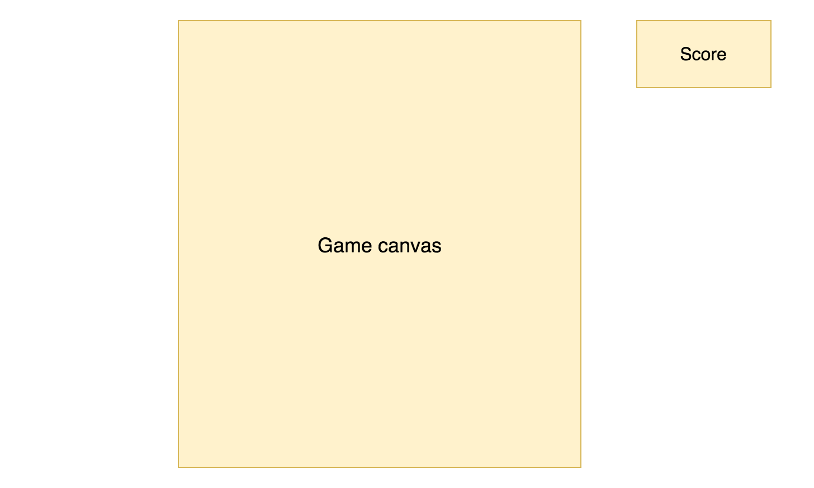

# Galagus

Galagus is a browser game based on the arcade classic Galaga. It was built with JavaScript and HTML5 Canvas. The player controls a ship which can shoot hostile space enemies, and the enemies enter the screen from different sides and combine into a grid formation. Enemies occasionally break formation and dart dangerously downwards toward the player's ship in an attempt to destroy it.

## MVP

- [ ] Player's ship moves left and right and can fire lasers.
- [ ] Enemies enter the screen uniformly and assemble in formation.
- [ ] Lasers destroy enemies, granting points.
- [ ] Enemies occasionally break formation and move downwards, either colliding with and destroying the ship or missing and reappearing at the top of the screen to re-enter formation.

## Wireframe

The screen will consist of a canvas element that will render the primary game logic and a score box to track the player's performance.

## Architecture & Design

Galagus will use plain JavaScript and HTML5's Canvas to render and animate the game. The game's main components will be broken down as follows:

`galaxy.js`: this file will construct the canvas with a starry background and initialize the primary game loop. The galaxy will contain a starship at the bottom and have predetermined spaces for where enemies can settle into formation.

`starship.js`: this file will contain the logic for controlling the player's ship, allowing it to move, and keeping track of whether the player has collided with an enemy and lost.

`enemy.js`: this file will contain the logic for an enemy's movement when entering the galaxy, when breaking formation to attack the starship, and when re-entering formation after an attack. Enemy destruction will result in a score increase.

`laser.js`: this file will act as a helper for `starship.js` and `enemy.js`, rendering the ship's laser shot movement and detecting enemy collision.

`utility.js`: this file will contain helper methods for collision detection and shared movements of objects.

## Implementation Timeline

**Day 1**: Layout the skeleton for `galaxy.js` to render and interact with the canvas, initializing a game loop that will `requestAnimationFrame()` and allow for animations. Once animations can be drawn, create `starship.js` and have it respond to keypresses to move ship left and right, then create `laser.js` and have ship be able to shoot.

**Day 2**: Create enemies with `enemy.js` and have them enter the screen and go towards an empty space in the formation and remain in formation. Implement laser collision detection so that enemies are destroyable and grant points.

**Day 3**: Introduce the capability for enemies to break formation and plummet downward toward the ship with potential to cause a game over. Have the enemy re-enter formation if the attack misses.

**Day 4**: Polish the galaxy canvas with a starry background and add in sound effects for laser shots, laser collision, enemy-to-ship collision, and the main Galaga theme song.
